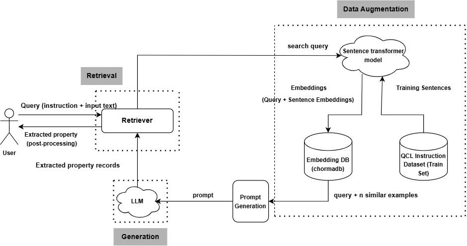
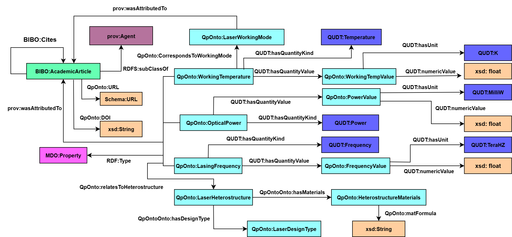

## Semantic Enrichment of QCL properties from Text
* The repository contains the materials (source code and data) for the work proposed in the paper "Semantic Enrichment of the Quantum Cascade Laser Properties in Text- A  Knowledge Graph Generation Approach". 
* In this work, we propopose a methodology for an automatic generation of a knowledge graph (KG) for the QCL semiconductor laser properties from scientific literature based on a RAG (Retrieval Augmented Generation) enabled LLM [[1]](https://arxiv.org/abs/2312.10997) and the QCL ontology[[2]](http://dx.doi.org/10.13140/RG.2.2.36315.13608).
* The approach entails automatic extraction of QCL prpoerties of interest form scientific literature based on a RAG-powered LLM  and population of the KG Schema with the extracted properties to generate the KG.

## Information Extraction Pipeline

## KG Schema

## KG Data Files and the SPARQL Queries
* The KG data files in RDF/XML and Turtle Formats can be accessed [here](https://github.com/DeperiasKerre/qKG/tree/main/qcl_KG).
* The SPARQL queries and there results can be found [here](https://github.com/DeperiasKerre/qKG/tree/main/Results/KG). 
## Citation
* Kerre, D., Laurent, A., Maussang, K., & Owuor, D. (2024). Semantic Enrichment of the Quantum Cascade Laser Properties in Text-A Knowledge Graph Generation Approach. In LLM-TEXT2KG 2025: 4th International Workshop on LLM-Integrated Knowledge Graph Generation from Text (Text2KG) Co-located with the Extended Semantic Web Conference (ESWC 2025), June 1 - June 5, 2025, Portoroz, Slovenia.
### License
This work is licensed under a [Creative Commons Attribution 4.0 International
License](http://creativecommons.org/licenses/by/4.0/).

## Acknowledgements
* This work was funded by the French Embassy in Kenya (Scientific and Academic Cooperation Depart-
ment) and the CNRS (under the framework “Dispositif de Soutien aux Collaborations avec l’Afrique
sub-saharienne”).
## References
* Gao, Y., Xiong, Y., Gao, X., Jia, K., Pan, J., Bi, Y., ... & Wang, H. (2023). Retrieval-augmented
generation for large language models: A survey. arXiv preprint arXiv:2312.10997.
* Kerre, D., Laurent, A., Maussang, K., & Owuor, D.(2024). A Concise Ontological Model of the
Design and Optoelectronic Properties in the Quantum Cascade Laser Domain. (Preprint-Under
Review).

